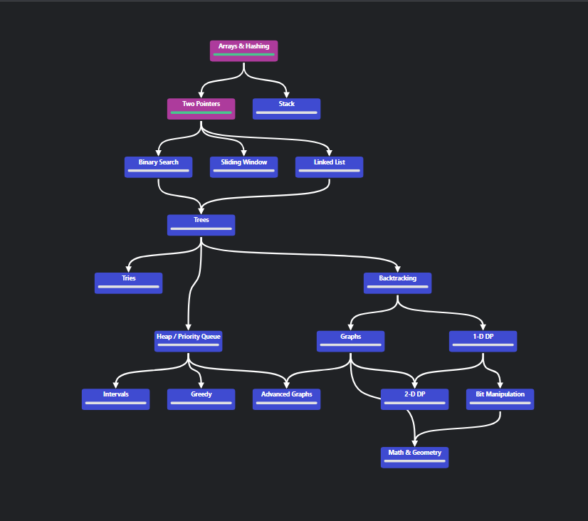

# 🚀 NeetCode DSA Solutions — @azuu-rgb



> Synced automatically from [NeetCode.io](https://neetcode.io)
> Repository: `neetcode-dsa-solutions`

---

## About this Repository

This repository contains my solutions to problems from **NeetCode**, focused on mastering:

* Data Structures 
* Algorithms 
* Coding Interview Preparation 

All solutions are automatically synced using the GitHub integration.

---

##  How Sync Works

1. Connect GitHub on NeetCode
2. Submit a solution
3. It gets pushed here automatically

Also supports:

* Auto-commit
* Bulk sync (all past problems)
* Manual sync per problem

---

## Topics Covered

Following the NeetCode roadmap:

* Arrays & Hashing
* Two Pointers
* Stack
* Binary Search
* Sliding Window
* Linked List
* Trees 🌳
* Tries
* Heap / Priority Queue
* Backtracking
* Graphs 🌐
* Dynamic Programming (1D & 2D)
* Greedy
* Intervals
* Bit Manipulation
* Math & Geometry

---

## Repository Structure

```
<topic>/
  <problem-name>/
    submission-0.py
    submission-1.py
```

### Example:

```
arrays/two-sum/submission-0.py
binary-search/search-in-rotated-array/submission-0.py
```

---

## Languages Used

* Python 
* JavaScript 
* TypeScript
* C++
* Java
* (and more depending on practice)

---

## Goal

Improve problem-solving skills and prepare for technical interviews by consistently practicing and documenting solutions.

---

## Notes

* Solutions may improve over time (better optimizations )
* Some problems may have multiple approaches
* Focus is on clarity + efficiency


## Roadmap


> 💡 *Consistency > perfection. Keep coding.*

